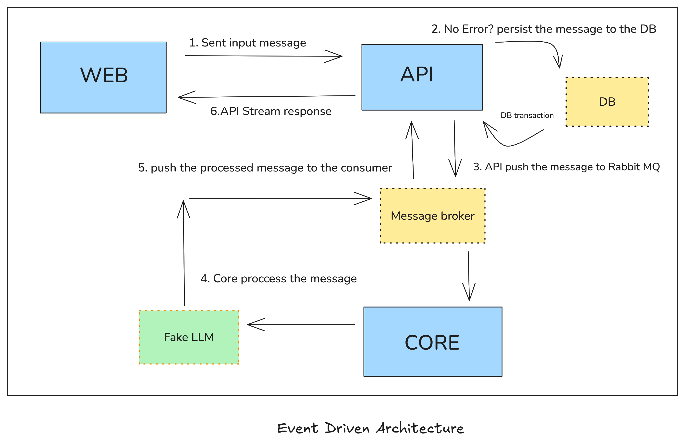

# DevOps Training Project

A microservices-based application demonstrating modern DevOps practices and asynchronous message processing architecture.

## Overview

This project showcases a distributed system consisting of three interconnected microservices that work together to provide an LLM-powered chat application with message persistence and asynchronous processing.

## Architecture Components

### 1. Web Frontend (`/components/web`)

- **Technology**: Next.js application
- **Purpose**: User interface for interacting with the LLM chat system
- **Features**: Modern React-based UI with responsive design

### 2. API Gateway (`/components/api`)

- **Technology**: Node.js backend service
- **Purpose**: Handles user requests, persists messages to database, and manages message queuing
- **Features**:
  - RESTful API endpoints
  - Database persistence (Prisma ORM)
  - RabbitMQ message publishing
  - Message validation and processing

### 3. Core Processing Service (`/components/core`)

- **Technology**: Node.js worker service
- **Purpose**: Processes queued messages and generates LLM responses
- **Features**:
  - RabbitMQ message consumption
  - Fake LLM integration for demonstration
  - Asynchronous message processing
  - Response generation and delivery

## System Architecture

The application follows an event-driven architecture pattern:

```
User → Web Frontend → API Gateway → Database + RabbitMQ → Core Service → Response
```



## Key Features

- **Microservices Architecture**: Loosely coupled services for scalability and maintainability
- **Message Queue Integration**: RabbitMQ for reliable asynchronous communication
- **Database Persistence**: Structured data storage with Prisma ORM
- **Modern Frontend**: Next.js with TypeScript for type safety
- **Containerization Ready**: Docker support for easy deployment

## Technology Stack

- **Frontend**: Next.js, React, TypeScript
- **Backend**: Node.js, Express
- **Database**: Prisma ORM
- **Message Queue**: RabbitMQ
- **Containerization**: Docker
- **Language**: TypeScript

## Getting Started

See individual component directories for setup instructions:

- [`/components/web`](./components/web) - Frontend application
- [`/components/api`](./components/api) - API gateway service
- [`/components/core`](./components/core) - Message processing service

## Project Structure

```
devops-training/
├── components/          # Microservices
│   ├── web/           # Next.js frontend
│   ├── api/           # Node.js API gateway
│   └── core/          # Message processing service
├── documentation/      # Project documentation and diagrams
└── README.md          # This file


```

## Contributing

This project serves as a training ground for DevOps practices. Feel free to explore the codebase and experiment with different deployment strategies.
