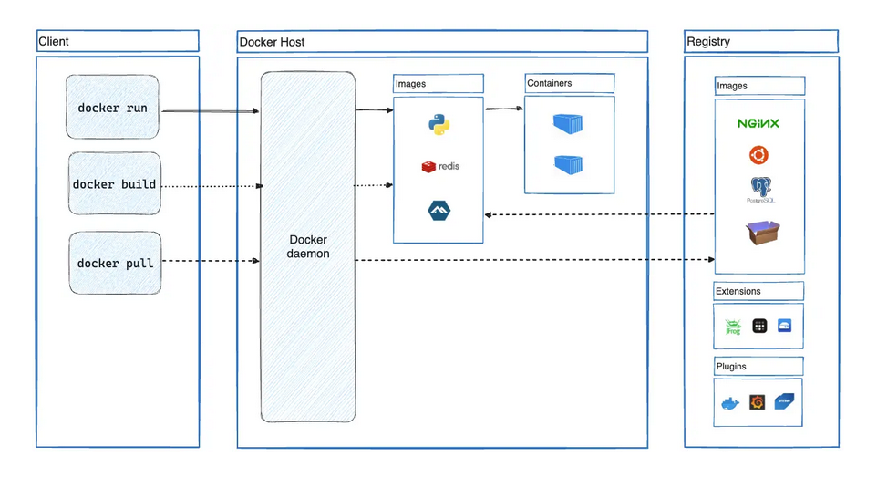

### 1. what is docker?

- Docker is an open platform for developing, shipping, and running applications.
- Docker allows you to separate your application from infrastructure.
- Docker allows running an application inside a loosely isolated environment called containers.
- The isolation and security let you run multiple containers simultaneously on given host.

  #### Containers

  - containers are lightweight and contains everything you need to run an application.
  - The unit for distributing and testing your applications
  - when you are ready, deploy your application into your production environment as a container or an orchestrated service. This works the same whether your production environment is a local data center, a cloud provider, or a hybrid of the two.
  - allowing developers to work in standardized environments using local containers which provide your applications and services.
  - Containers are great for continuous integration and continuous delivery (CI/CD) workflows.

### Docker Architecture

Docker uses a client-server architecture. The Docker client (docker) talks to the Docker daemon (dockerd), which does the heavy lifting of building, running, and distributing your Docker containers. The Docker client and daemon can run on the same system, or you can connect a Docker client to a remote Docker daemon. The Docker client and daemon communicate using a REST API, over UNIX sockets or a network interface. Another Docker client is Docker Compose, that lets you work with applications consisting of a set of containers.

#### Docker engine vs Docker daemon

The Docker daemon (dockerd) is a fundamental component of the Docker Engine. The Docker Engine provides the complete ecosystem for containerization, while the Docker daemon is the background process that performs the actual work of managing Docker objects based on instructions received through the Docker Engine's API



### Docker objects

When you use Docker, you are creating and using images, containers, networks, volumes, plugins, and other objects. This section is a brief overview of some of those objects.

#### Image

An image is a read-only template with instructions for creating a Docker container. Often, an image is based on another image, with some additional customization.

#### Container

A container is a runnable instance of an image. You can create, start, stop, move, or delete a container using the Docker API or CLI

=> Docker is written in the Go programming language.

## 1. Project Setup - Demo

#### Postgres database service

- Pull the official postgres Image from the docker registry

```sh
$ docker pull postgres
```

- Run the container

```sh
$ docker run --name insta-training-db -e POSTGRES_PASSWORD=insta-training -d postgres
```

- We can always configure the Mapping PORT. In case we do not specify it while creating the container. (there is no straightforward command of that matter)

we need to:

-> inspect running containers

```sh
 docker ps
```

-> stop the running container:

```sh
 docker stop <container_name_or_id>
```

-> remove the container

```sh
 docker rm <container_name_or_id>
```

-> recreate the container with specifying the mapping PORT

```sh
$ docker run --name insta-training-db -e POSTGRES_PASSWORD=insta-training -p 5432:5432 -d postgres
```

- Inspect the container mapped PORT

```sh
 docker port <container_name_or_id>
```

- Restart the container: (restart it with a -d flag)

```sh
 docker restart <container_name_or_id>
```

- start the container: (start the container with a detach mode)

```sh
 docker start <container_name_or_id>
```

### Docker Networking

Docker networking facilitates communication between Docker containers, and between containers and the outside world, abstracting the underlying infrastructure.

Docker provides various network drivers, each suited for different use cases.

#### Network Drivers:

- Bridge (default): Creates a private internal network for containers on a single host, allowing them to communicate by IP address. Port mapping is required for external access.

- Host: Removes network isolation, directly using the host machine's network stack. This can simplify networking for some applications but reduces isolation.

- Overlay: Enables multi-host container communication in a Docker Swarm or Kubernetes cluster, providing built-in service discovery, load balancing, and encryption.

- None: Disables all networking for a container, useful for containers that do not require network access.

- Macvlan/Ipvlan: Assigns a MAC address and IP address to containers directly from the physical network, making them appear as physical devices on the network.

#### Create a name-based custom Network

Containers connected to the same custom network can resolve each other by name

```sh
 docker network create <network_name>
```

1. ##### Port Mapping:

To allow external access to services running inside a container on a bridge network, specific container ports must be mapped to host ports using the -p or --publish flag during container creation.

2. ##### Network Isolation:

Docker utilizes network namespaces to isolate container networks, providing a level of security and preventing conflicts between container network configurations.

- Check the networks driver used for insta-training-db container:

```sh
 docker inspect <network_name>
```

###### Option 1: Re-create the container with a Host network

```sh
 docker run --name insta-training-db -e POSTGRES_PASSWORD=insta-training --network host -d postgres
```

###### Option 1: Access database from a docker API container runs on the same custom Bridge Network

```sh
 docker network create --driver bridge <network_name>
```

```sh
 docker network ls
```

- Delete a Network

```sh
 docker network disconnect <network_name> <container_name_or_id>
```

```sh
  docker network rm <network_name_or_id>
```

### Containerize the API component

- Build the API container

```sh
  docker build -t <container_image_name> -f custom-docker-filename (.)
```

- Run the API container

```sh
  docker run --name insta-training-api-container -d insta-training-api-image
```

### Multi Stage builds

### Build variables

- build arguments (ARG) and environment variables (ENV) are similar. They're both declared in the Dockerfile and can be set using flags for the docker build command. Both can be used to parameterize the build. But they each serve a distinct purpose.

1. ##### Build arguments

- build arguments are variables we Use them to parameterize values of Dockerfile instructions.
- They're not accessible or present in containers instantiated from the image

```sh
  docker build -t image-tag --build-arg NODE_ENV=development .
```

2. ##### Environment variables

- Environment variables are passed through to the build execution environment, and persist in containers instantiated from the image.

```sh
  docker run --name container_name -e DATABASE_URL="..." image_name
```

3. ##### Build secrets

- A build secret is any piece of sensitive information, such as a password or API token, consumed as part of your application's build process.

Build arguments and environment variables are inappropriate for passing secrets to your build, because they persist in the final image. Instead, you should use secret mounts or SSH mounts, which expose secrets to your builds securely.

=> keep info private within the container.
=> secrets at runtime, never at build time!
