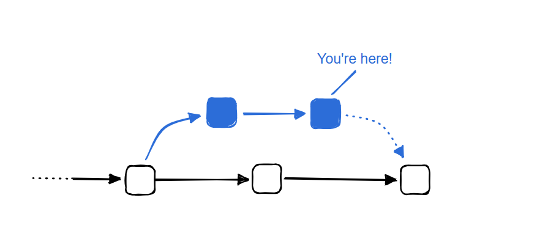

# Continuous integration with Docker

Continuous Integration (CI) is the part of the development process where you're looking to get your code changes merged with the main branch of the project.

There are several uses for Docker at this stage of development, even if you don't end up packaging your application as a container image.

### Docker as a build environment

Containers are reproducible, isolated environments that yield predictable results. Building and testing your application in a Docker container makes it easier to prevent unexpected behaviors from occurring.

### Github Actions

GitHub Actions is a popular CI/CD platform for automating your build, test, and deployment pipeline. Docker provides a set of official GitHub Actions for you to use in your workflows. These official actions are reusable, easy-to-use components for building, annotating, and pushing images.
