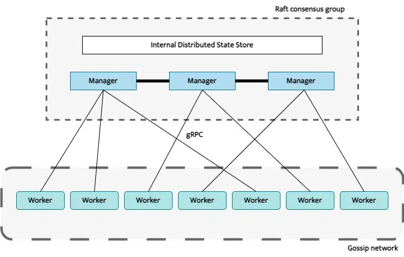

### Docker Swarm:

Docker Swarm is a native clustering and orchestration tool designed to manage a cluster of Docker hosts as a single virtual system.
Its purpose is to automate the deployment, scaling, and management of containerized applications across multiple machines, providing high availability and simplified operations

###### Swarm Architecture



###### Key purposes and features

- **High availability:** Docker Swarm ensures applications remain available even if a node fails. Services are automatically rescheduled to healthy nodes, and multiple manager nodes can be set up to prevent a single point of failure.

- **Simplified scaling:** It allows you to easily scale services up or down by adjusting the number of container replicas with a single command. The swarm manager automatically adapts by adding or removing tasks to maintain the desired state.

- **Integrated load balancing:** An internal load balancer and ingress routing mesh distribute incoming traffic across the containers in a service. This ensures an even workload and high performance without needing external tools.

- **Service discovery:** The swarm manager assigns a unique DNS name to each service, allowing containers to discover and communicate with each other internally using service names.

- **Rolling updates:** You can deploy service updates incrementally with zero downtime. Swarm allows you to control the rollout process and can automatically roll back to a previous version if an update fails.

- **Security:** By default, each node enforces mutual Transport Layer Security (TLS) authentication and encryption for secure communication within the swarm.

- **Desired state reconciliation:** The swarm manager constantly monitors the cluster's actual state and works to match it to the declared desired state. For example, if a node hosting containers fails, the manager automatically replaces the lost containers.

### Feature limitations

- **Fewer advanced features:** Compared to the industry-leading Kubernetes, Docker Swarm lacks many advanced features. It has fewer automation capabilities and doesn't offer sophisticated options for networking, security, or deployment strategies.

- **No automated scaling:** Docker Swarm does not include a built-in horizontal pod autoscaler to automatically adjust the number of replicas based on metrics like CPU usage. Scaling must be performed manually.

- **Basic monitoring and logging:** Swarm provides only basic server logs and event tools. For comprehensive monitoring and logging, you must integrate third-party tools, unlike Kubernetes, which offers these features out-of-the-box.

- **Less robust fault tolerance:** While Swarm offers high availability, its self-healing and resilience capabilities are not as advanced as those in Kubernetes

- **Not ideal for large-scale deployments:** Docker Swarm can struggle with very large and complex workloads involving thousands of containers. While it is suitable for medium-sized applications, it cannot compete with Kubernetes' ability to manage enterprise-level infrastructure. The maximum recommended number of manager nodes is also limited to seven, which may not be sufficient for very large environments.

- **Uncertain future:** The ecosystem around Docker Swarm is smaller than Kubernetes, and Docker itself has shifted its focus. Docker, Inc. now recommends Kubernetes for most production environments, which has led to less active development of Swarm in recent years

### Docker Swarm vs Docker Compose:

- **Docker Compose:** is suitable for scaling on a single host, primarily for development and testing environments.

- **Docker Swarm:** is designed for scaling across multiple hosts in a cluster, offering advanced orchestration features for production environments requiring high availability, fault tolerance, and load balancing.

### Swarm in practice

1. Enable Docker Swarm

```sh
docker swarm init --advertise-addr 192.168.127.2
```

2. Check nodes

```sh
docker node ls
```

### Swarm nodes

A node is simply any machine—either physical or virtual—that is running a Docker Engine instance in "swarm mode"

###### Physical vs. virtual nodes

- **Physical machines (bare metal):** You can set up a Swarm cluster on a network of physical servers. This is common in production environments where maximizing performance and minimizing overhead are priorities.

- **Virtual machines (VMs):** You can also create a Swarm using VMs. This is a very common approach for testing and development environments, as it is simple to provision multiple VMs on a single computer or in the cloud to simulate a multi-node cluster. Many production Swarms also run on VMs provisioned by cloud providers like Amazon Web Services (AWS), Google Cloud Platform (GCP), or Azure.

- Use **Docker-in-Docker**, **Docker Machine**, or **Multipass** to spin up virtual nodes.

### Swarm Services

A Docker Swarm service represents a desired state for a containerized application within a Docker Swarm cluster. Instead of running individual containers on specific hosts, a service defines how many identical instances (replicas) of a given container image should be running across the entire swarm, along with their configuration (e.g., published ports, network settings, resource limits).

### Swarm Stack

Docker stack is a collection of services that make up an application in a specific environment

3. Create swarm worker

```sh
docker swarm join-token worker
```

```sh
docker swarm join --token
```

4. Convert Compose to Swarm Stack

Swarm uses stacks. The good news: it reuses Compose files.
A stack provides a convenient, declarative way to orchestrate a multi-container application across a Swarm cluster.
stack is created from a standard Docker Compose file but is specifically deployed to a Docker Swarm cluster using the docker stack deploy command

```sh
docker stack deploy -c compose.yml stack_name
```

5. List stack

```sh
docker stack ls
```

6. List services inside a stack

```sh
docker stack services stack_name
```

7. List running services

```sh
docker service ls
```

```sh
docker service ps container_name (view running containers replicas)
```

8. Remove Stack

```sh
docker stack rm stack_name
```

9. Scale Services

```sh
docker service scale service-name=10
```

```yml
deploy
    replicas: 5
```

12. Leave swarm mode - Tear Down

```sh
docker swarm leave --force
```

##### Takeaways

1. in Swarm, services can only use:

- overlay networks (multi-host capable, swarm-aware)

- or the default ingress network (used for load-balancing).

**Bridge networks** = only local to one host → not valid in Swarm.

**Overlay networks** = span across all nodes in the swarm → the right choice for stack deployments.

If you don’t declare a network, Swarm uses ingress, but that’s mainly for external traffic, not service-to-service communication.

2. ###### Local Images

In Compose, you can have both **build:** and **image:.** If you forget **image:**, Compose will auto-generate one when building.

In Swarm, services must always have an image reference **(image: something)** — Swarm cannot build images for you, it only deploys them.

3. ###### Publishing Port in Swarm

When you use Compose, ports are published by default as you wrote in ports: "3001:3001" → you can hit http://localhost:3001.

When you use Swarm with docker stack deploy:

Swarm uses a routing mesh.

The service is load-balanced across all nodes (even if you have only one node).

To expose a service externally, you must publish ports explicitly in a way Swarm understands.

If the port is not properly published, your container is running, but nothing is listening on localhost:3001.

```yml
ports:
  - target: 3001
    published: 3001
    protocol: tcp
    mode: host
```

##### Imperative (without compose)

- Initialize the swarm:

```sh
docker swarm init
```

- Create a service

```sh
docker service create --name imperative-api-container -p 3000:3000 --replicas 3 backend-swarm-container:latest
```

- list replicas

```sh
docker service ls
```

- scale the number of replicas

```sh
docker service scale imperative-api-container=10
```

- Remove the service

```sh
docker service rm imperative-api-container
```

#### Docker swarm secrets

Secrets are stored in the Swarm itself, not in your YAML.

Secrets in Swarm are stored encrypted on disk and in Raft logs.

Mounted into containers at runtime at /run/secrets/<name>.

Services can read them via files (\*\_FILE env vars are super useful).

Safer than baking passwords into images or Compose files.

- Create a secret

```sh
echo "password" | docker secret create postgres_password -
```
